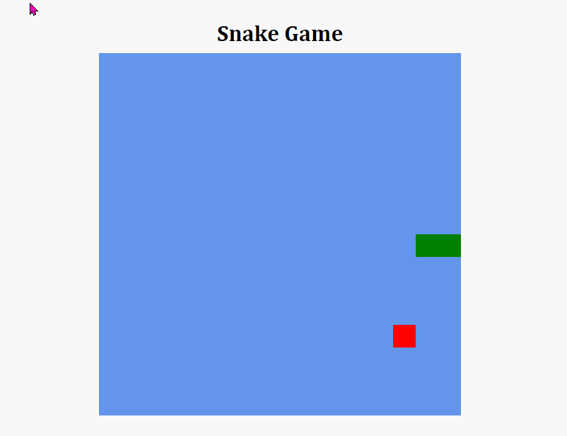

## Sobre

Recriando o clássico jogo da cobrinha utilizando HTML, CSS e JavaScript. desafio do bootcamp HTML Web Developer da Digital Innovation One.

<h4 align="center"> 
	✅ SNAKE GAME 🚀  CONCLUÍDO ✅
</h4>

---

## 📱 Demonstração  da tela 📱

<figure>
    <figcaption>Snake Game</figcaption>
     
    
</figure>

---

## 🔨 Tecnologias utilizadas 🔨

<ul>
    <li>HTML5</li>
    <li>CSS3</li>
    <li>JAVASCRIPT</li>
</ul>

---

## 👷  Autor 👷

Leandro Nascimento

